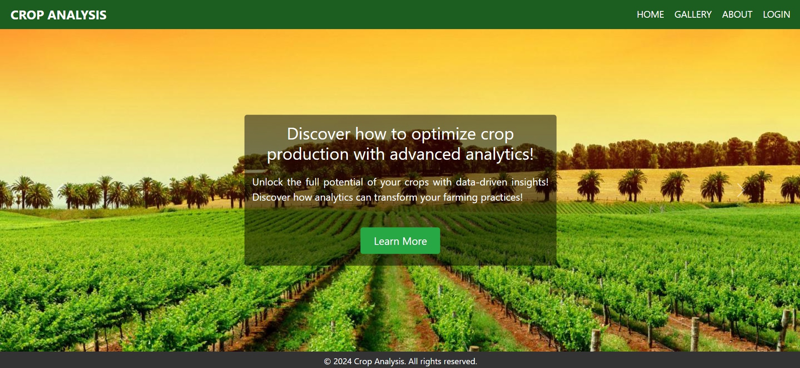
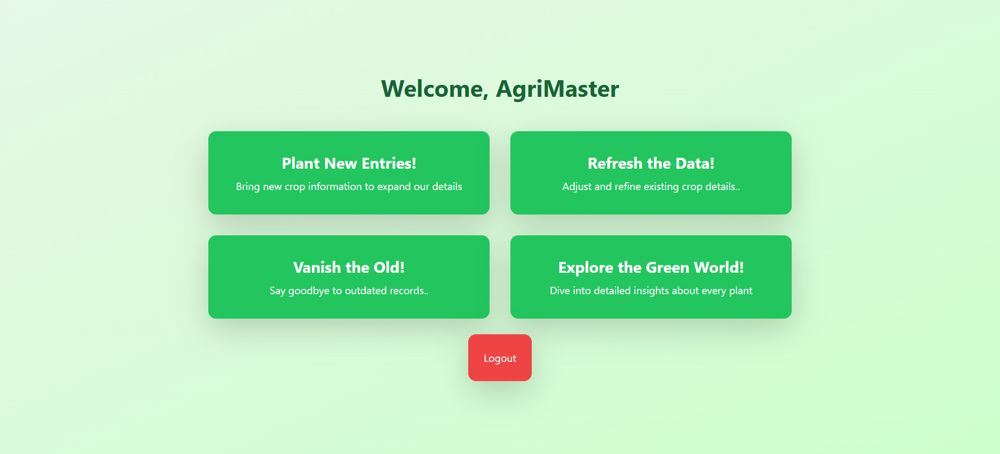
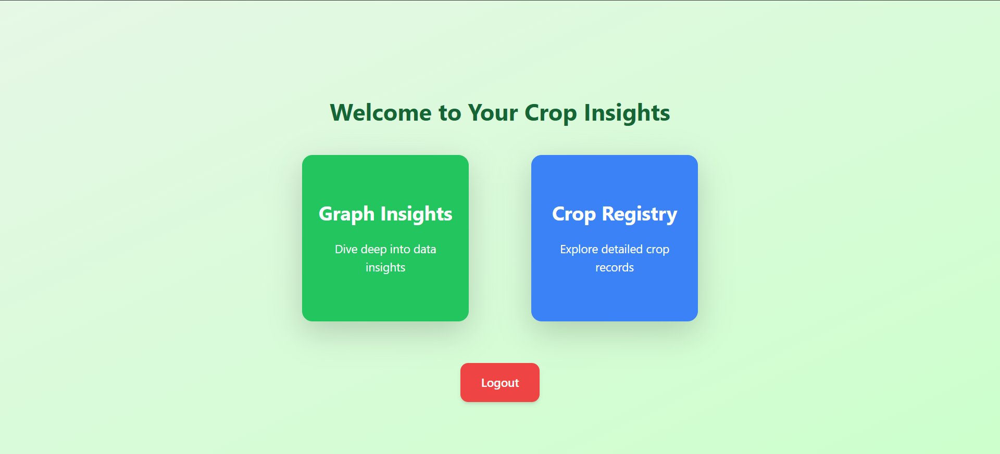
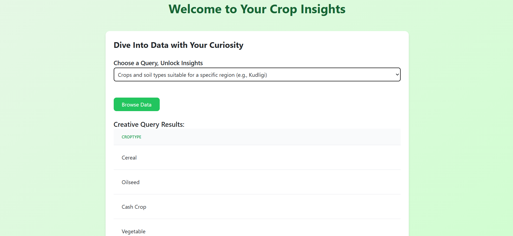
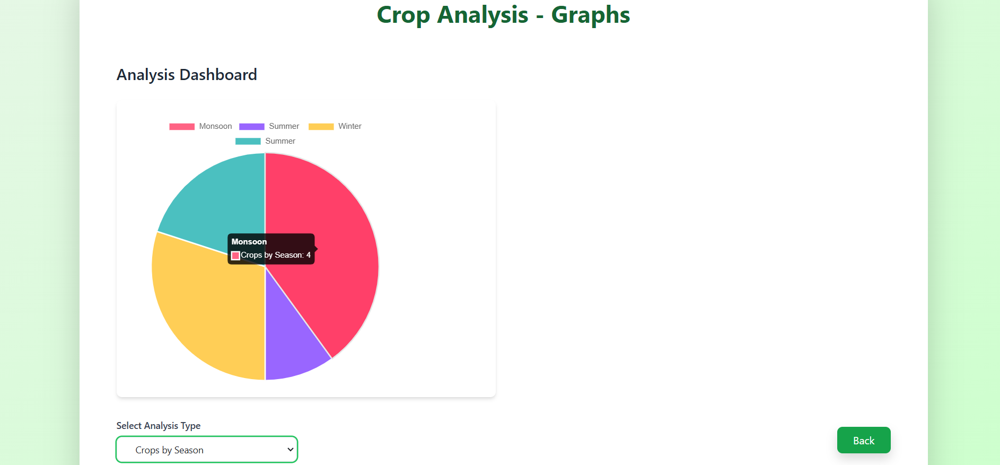

### Crop Analysis Project
## Overview
This is a full-stack web application designed to provide insights into different crops based on seasons, weather conditions, and soil types.
## Technologies Used
- *Frontend:*React
- *Backend:* Node.js, Express.js
- **Database:* MySQL
## Installation & Setup
### 1️⃣ Clone the Repository
```bash
git clone https://github.com/amruthapoojary/Crop-Insight
cd Crop-Insight
```
### 2️⃣ Install Dependencies
```bash
npm install
```
### 3️⃣ Set Up MySQL Database
* Create a new database using the provided SQL schema (database/schema.sql)
* Update database credentials in the .env file
## Running the Project
### Start the Backend Server
```bash
node server.js
```
This will run the backend on `http://localhost:5000\`.
### Start the React Frontend
```bash
npm start
```
This will run the frontend on `http://localhost:3000\`.
## Features
* ✔️ *User Dashboard* - Crop insights & recommendations
* ✔️ *Admin Dashboard* - Manage crop data
* ✔️ *Database Integration* - MySQL storage
## Screenshots
### Homepage View

### Admin Dashboard

### User Dashboard

### Analysis Results


## License
This project is licensed under the MIT License.


